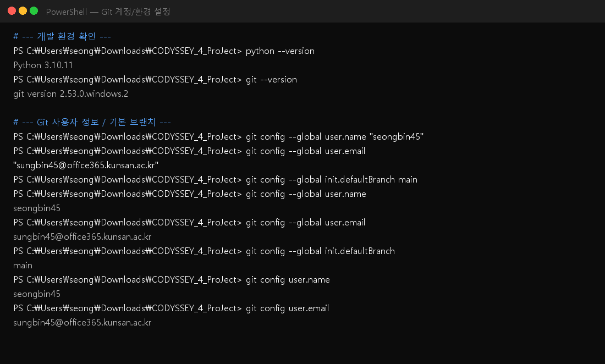
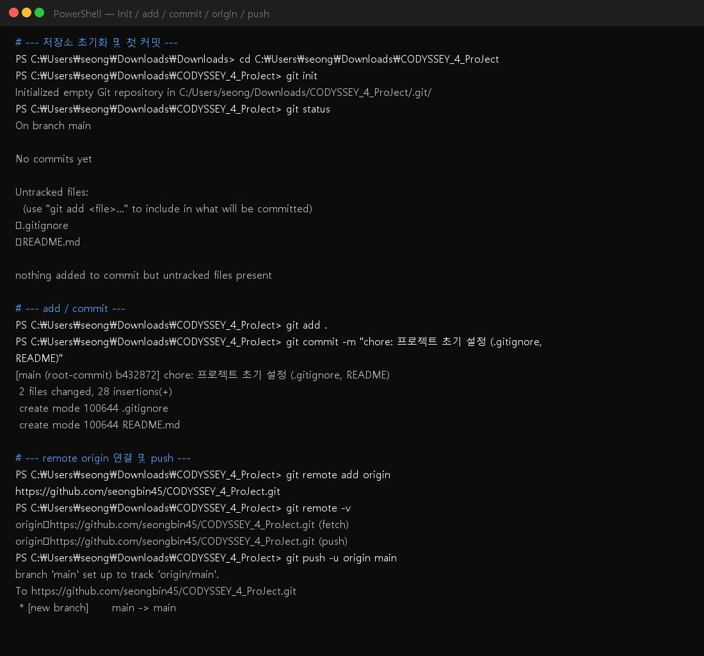
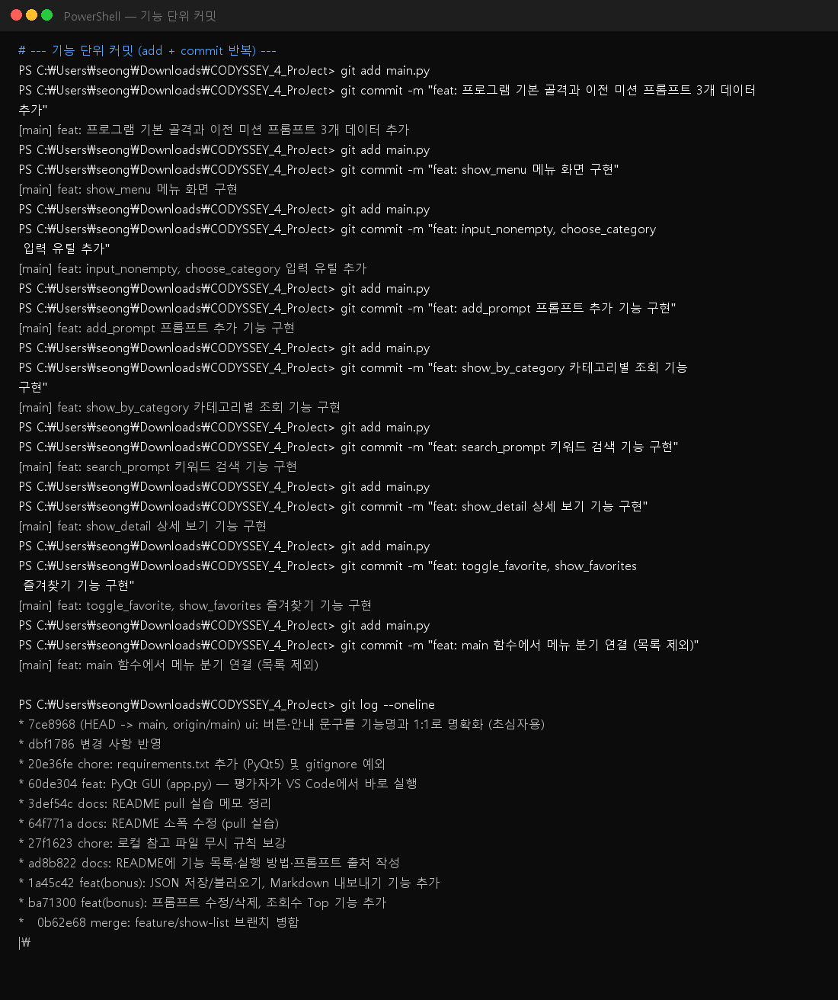
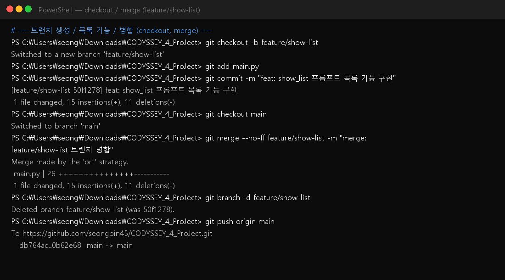
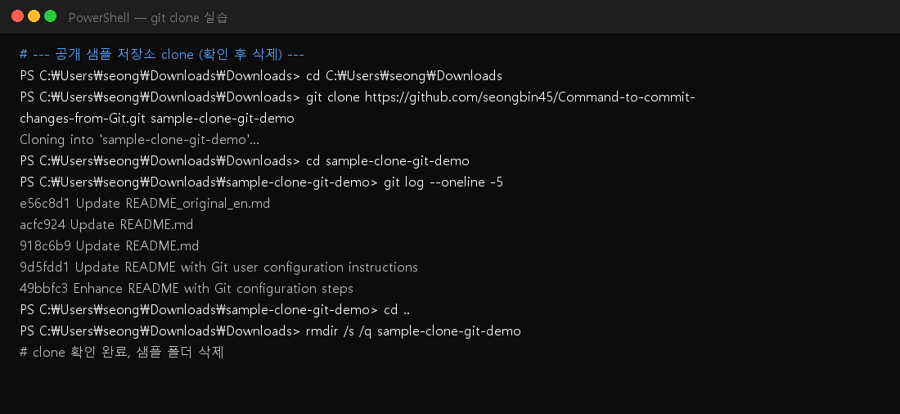
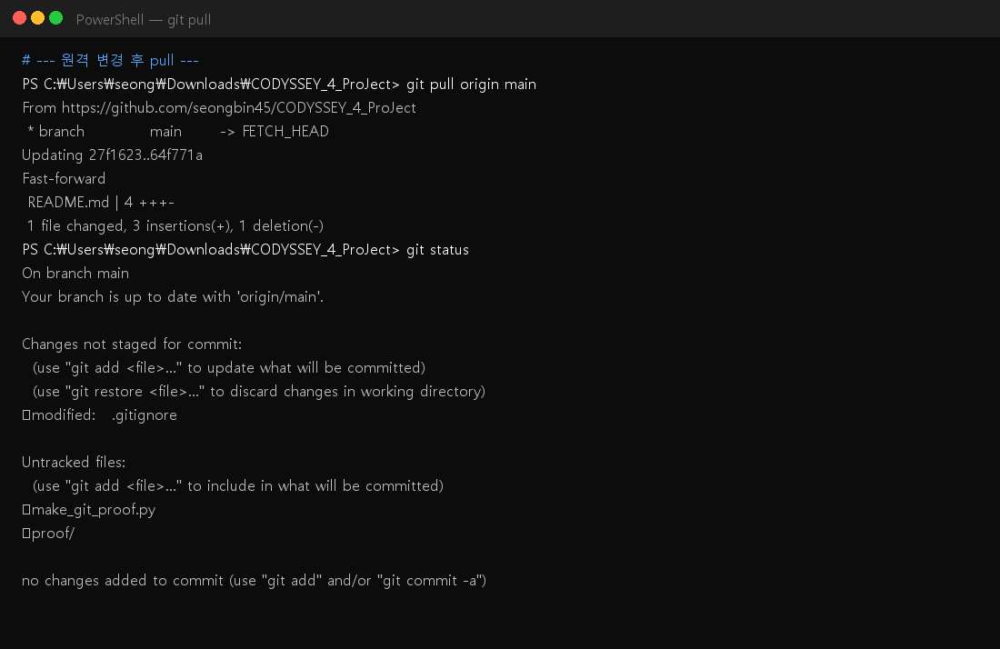
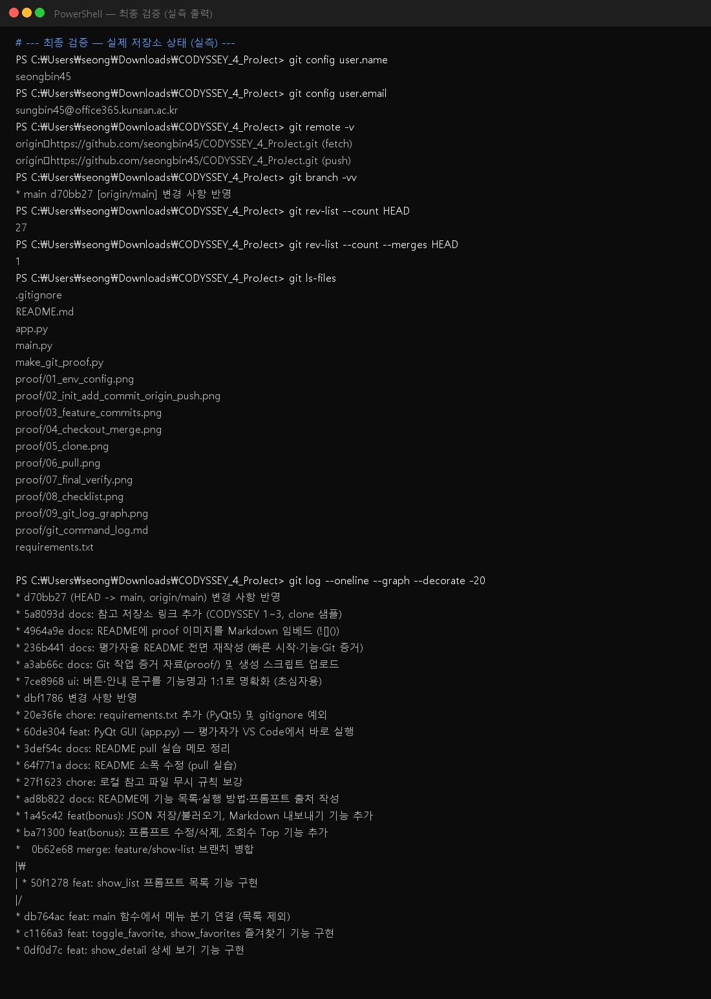
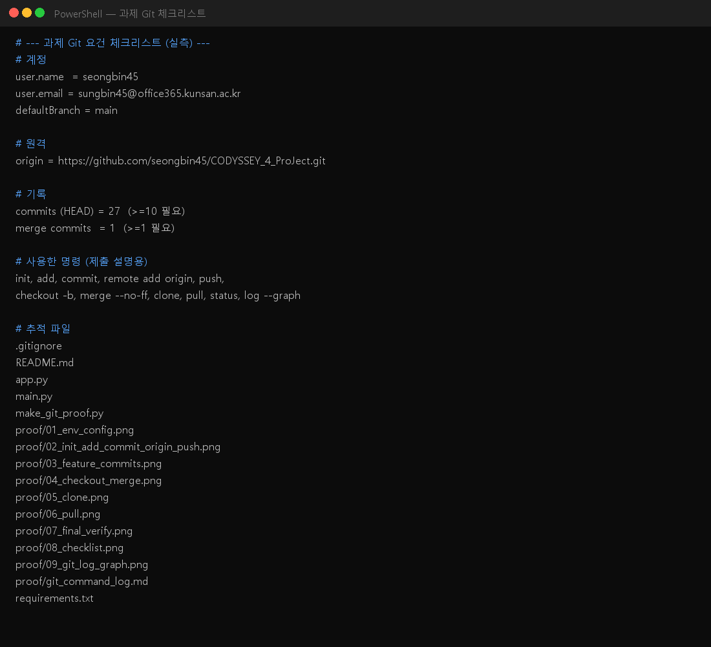
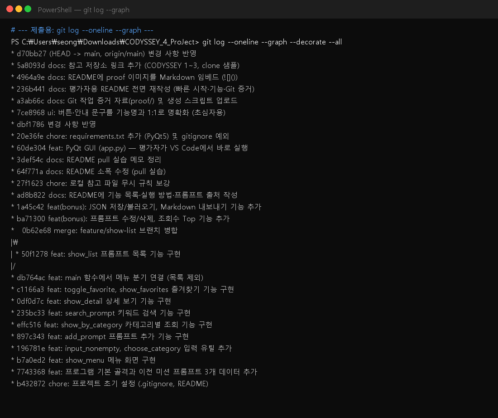

# 나만의 프롬프트 관리 프로그램

> **Python & Git 기초 미션 (Codyssey)**  
> 이전 미션에서 쌓인 프롬프트를 등록·조회·검색·즐겨찾기하는 프로그램입니다.

| 항목 | 내용 |
|---|---|
| 저장소 | https://github.com/seongbin45/CODYSSEY_4_ProJect |
| 언어 | Python 3.10 이상 |
| 필수 실행 | `main.py` (콘솔, 외부 라이브러리 없음) |
| 평가자 권장 실행 | `app.py` (PyQt GUI, 클릭만으로 기능 확인) |

---

## 1. 평가자 빠른 시작 (3분)

### 방법 A — GUI (권장, 가장 쉬움)

1. 이 저장소를 연다 (Clone 또는 ZIP 해제).
2. VS Code에서 **`app.py`** 파일을 연다.
3. **Run ▶** 을 누르거나, 터미널에서 아래를 실행한다.

```bash
python app.py
```

- **PyQt5가 없으면** 첫 실행 시 자동 설치를 시도합니다.  
- 자동 설치가 안 되면 아래를 한 번만 실행하세요.

```bash
python -m pip install -r requirements.txt
```

4. 창이 열리면:
   - **왼쪽 목록**을 클릭 → 상세 보기 (메뉴 5)
   - 상단 **프롬프트 검색 / 목록 / 즐겨찾기 / 조회수 Top** 버튼 사용
   - 하단 **프롬프트 추가·수정·삭제**, **JSON 저장/불러오기** 등 사용

### 방법 B — 콘솔 (과제 필수 형태)

```bash
python main.py
```

메뉴 번호(0~12)를 입력해 기능을 선택합니다.  
**외부 라이브러리 없이** 표준 라이브러리만 사용합니다.

---

## 2. 이 프로그램이 하는 일

터미널(또는 GUI)에서 프롬프트를 관리합니다.

- 프롬프트 **추가 / 목록 / 카테고리별 조회 / 검색 / 상세 보기**
- **즐겨찾기** 추가·해제 및 즐겨찾기만 모아 보기
- (보너스) **수정·삭제**, **조회수 Top**, **JSON 저장·불러오기**, **Markdown 내보내기**

실행 중 데이터는 **메모리(리스트)** 에 유지됩니다.  
프로그램을 종료하면 초기화되며, **메뉴 10번(JSON으로 저장)** 으로 파일에 남길 수 있습니다.

---

## 3. 기능 목록 (콘솔 메뉴)

| 번호 | 기능 | 설명 | 구분 |
|:---:|---|---|---|
| 1 | 프롬프트 추가 | 제목 / 내용 / 카테고리 입력 후 등록 | 필수 |
| 2 | 프롬프트 목록 | 전체 목록을 번호와 함께 출력 | 필수 |
| 3 | 카테고리별 조회 | 선택한 카테고리만 출력 | 필수 |
| 4 | 프롬프트 검색 | 제목·내용 키워드 검색 | 필수 |
| 5 | 프롬프트 상세 보기 | 전체 내용 출력, 조회수 +1 | 필수 |
| 6 | 즐겨찾기 관리 | 즐겨찾기 추가 / 해제 | 필수 |
| 7 | 즐겨찾기 목록 | 즐겨찾기한 항목만 보기 | 필수 |
| 8 | 프롬프트 수정/삭제 | 기존 항목 편집 또는 삭제 | 보너스 |
| 9 | 조회수 Top 목록 | 조회수 높은 순 정렬 | 보너스 |
| 10 | JSON으로 저장 | `prompts.json` 에 저장 | 보너스 |
| 11 | JSON에서 불러오기 | `prompts.json` 복원 | 보너스 |
| 12 | Markdown 내보내기 | `exports/카테고리.md` 생성 | 보너스 |
| 0 | 종료 | 프로그램 종료 | 필수 |

### 카테고리

`텍스트 생성` · `이미지 생성` · `영상 생성` · `페르소나` · `자동화` · `기타`  
(추가 시 목록 선택 또는 **직접 입력** 가능)

---

## 4. GUI 버튼 ↔ 콘솔 메뉴 대응

`app.py` 버튼 이름은 **기능 이름과 동일**하게 맞춰 두었습니다.  
마우스를 버튼 위에 올리면 짧은 설명(툴팁)도 표시됩니다.

| GUI에서 보이는 이름 | 하는 일 | 콘솔 |
|---|---|:---:|
| 프롬프트 검색 | 제목·내용 키워드 검색 | 4 |
| 프롬프트 목록 (전체) | 전체 목록 다시 보기 | 2 |
| 즐겨찾기 목록 | 즐겨찾기만 모아 보기 | 7 |
| 조회수 Top 목록 | 조회수 높은 순 정렬 | 9 |
| 카테고리별 조회 (상단 콤보) | 카테고리 필터 | 3 |
| 왼쪽 목록 클릭 | 상세 보기 (조회수 +1) | 5 |
| 프롬프트 추가 | 새 프롬프트 등록 | 1 |
| 프롬프트 수정 | 선택 항목 편집 | 8 |
| 프롬프트 삭제 | 선택 항목 삭제 | 8 |
| 즐겨찾기 추가/해제 | 즐겨찾기 on/off | 6 |
| JSON으로 저장 | `prompts.json` 저장 | 10 |
| JSON에서 불러오기 | `prompts.json` 복원 | 11 |
| Markdown 파일로 내보내기 | `exports/` 폴더에 .md 생성 | 12 |

**단축키**

| 키 | 동작 |
|---|---|
| `Ctrl + N` | 프롬프트 추가 |
| `Ctrl + S` | JSON으로 저장 |
| `Ctrl + F` | 검색창으로 이동 |
| `F5` | 목록 새로고침 |

---

## 5. 기본 프롬프트 3개 (이전 미션 원문)

프로그램 시작 시 **이전 미션에서 실제 사용한 프롬프트 원문** 3개가 미리 등록되어 있습니다.

| # | 제목 | 카테고리 | 출처 저장소 · 파일 |
|:---:|---|---|---|
| 1 | 확인봇 - 창업지원 실무 이메일 코치 (1주차) | 페르소나 | [CODYSSEY_1_ProJect](https://github.com/seongbin45/CODYSSEY_1_ProJect) · `bot/prompts/system_prompt.md` |
| 2 | FinFit 광고 씬1 - 문제 제시 (Veo, 2주차) | 영상 생성 | [CODYSSEY_2_ProJect](https://github.com/seongbin45/CODYSSEY_2_ProJect) · `Docs/video_prompts_model_variants.md` (Veo 3.1) |
| 3 | 지출 메모 자동 분류 (Make/n8n, 3주차) | 자동화 | [Codyssey_3_ProJect](https://github.com/seongbin45/Codyssey_3_ProJect) · project1 n8n / Make OpenAI 시스템 프롬프트 |

각 프롬프트는 제목, 내용, 카테고리, 즐겨찾기 여부, 조회수를 가집니다.

### 참고한 저장소

| 구분 | 저장소 | 이 프로젝트에서의 역할 |
|---|---|---|
| 1주차 · 페르소나 프롬프트 | https://github.com/seongbin45/CODYSSEY_1_ProJect | 확인봇 시스템 프롬프트 원문 |
| 2주차 · 영상 프롬프트 | https://github.com/seongbin45/CODYSSEY_2_ProJect | FinFit Veo 씬1 프롬프트 원문 |
| 3주차 · 자동화 프롬프트 | https://github.com/seongbin45/Codyssey_3_ProJect | 지출 메모 자동 분류 시스템 프롬프트 원문 |
| Git clone 실습 샘플 | https://github.com/seongbin45/Command-to-commit-changes-from-Git | 공개 저장소 `git clone` 연습용 |
| 이번 미션 (본 저장소) | https://github.com/seongbin45/CODYSSEY_4_ProJect | 프롬프트 관리 프로그램 |

---

## 6. 프로젝트 구조

```
CODYSSEY_4_ProJect/
├── main.py              # 콘솔 프로그램 (필수) + 공통 데이터
├── app.py               # PyQt GUI (평가자 권장)
├── requirements.txt     # GUI용: PyQt5
├── README.md            # 이 문서
├── .gitignore
├── make_git_proof.py    # Git 증거 이미지 생성 스크립트
└── proof/               # Git 작업 증거 자료 (이미지·로그)
    ├── 01_env_config.png
    ├── 02_init_add_commit_origin_push.png
    ├── 03_feature_commits.png
    ├── 04_checkout_merge.png
    ├── 05_clone.png
    ├── 06_pull.png
    ├── 07_final_verify.png
    ├── 08_checklist.png
    ├── 09_git_log_graph.png
    └── git_command_log.md
```

실행 후 생성될 수 있는 파일(저장소에는 커밋하지 않음):

| 파일/폴더 | 설명 |
|---|---|
| `prompts.json` | 메뉴 10번으로 저장한 데이터 |
| `exports/` | 메뉴 12번 Markdown 내보내기 결과 |

---

## 7. 구현 방식 (간단 설명)

- **데이터**: 리스트 + 딕셔너리 (`prompts`)
- **구조**: 기능별 함수 분리  
  예) `show_menu`, `add_prompt`, `show_list`, `search_prompt`, `show_favorites` 등
- **콘솔(`main.py`)**: 외부 라이브러리 없음 (`json`, `os` 만 보너스 기능에 사용)
- **GUI(`app.py`)**: `main.py` 의 데이터·상수를 그대로 사용 (같은 기본 프롬프트)

---

## 8. Git 작업 기록 (평가 포인트)

### 확인 방법

```bash
git log --oneline --graph --decorate
git rev-list --count HEAD          # 커밋 수 (10개 이상)
git rev-list --count --merges HEAD # merge 커밋 존재 여부
```

### 사용한 Git 명령

| 명령 | 용도 |
|---|---|
| `git init` | 저장소 시작 |
| `git add` / `git commit` | 기능 단위 커밋 |
| `git remote add origin` / `git push` | GitHub 업로드 |
| `git checkout -b` / `git merge` | 브랜치 작업·병합 (`feature/show-list`) |
| `git clone` | 공개 샘플 저장소 내려받기 실습 |
| `git pull` | 원격 변경 반영 |

- **clone 실습 대상**: [Command-to-commit-changes-from-Git](https://github.com/seongbin45/Command-to-commit-changes-from-Git)  
- **프롬프트 목록(`show_list`)** 기능은 `feature/show-list` 브랜치에서 작업 후 **main에 merge** 했습니다.  
- 커밋은 기능 단위로 나뉘어 있으며, 그래프에 merge 분기가 보입니다.

### 증거 자료 (`proof/` — README에 바로 표시)

GitHub에서 이 README를 열면 아래 이미지가 본문에 보입니다.  
문법: ``

#### 01. 계정 · 환경 설정



#### 02. init / add / commit / origin / push



#### 03. 기능 단위 커밋



#### 04. checkout / merge (feature/show-list)



#### 05. clone



#### 06. pull



#### 07. 최종 검증 (실측)



#### 08. 요건 체크리스트



#### 09. git log --graph



#### 텍스트 로그

- 상세 명령 기록: [`proof/git_command_log.md`](proof/git_command_log.md)

이미지를 다시 만들려면:

```bash
python -m pip install pillow
python make_git_proof.py
```

---

## 9. 환경 요구 사항

| 항목 | 요구 |
|---|---|
| Python | 3.10 이상 |
| Git | 설치 및 사용자 이름·이메일 설정 |
| 콘솔 버전 | 추가 패키지 **없음** |
| GUI 버전 | `PyQt5` (`requirements.txt`) |

사용자 정보 확인 예:

```bash
python --version
git --version
git config user.name
git config user.email
```

---

## 10. 문제 해결

| 증상 | 해결 |
|---|---|
| `app.py` 실행 시 PyQt 오류 | `python -m pip install PyQt5` 후 다시 실행 |
| `python` 을 찾을 수 없음 | VS Code 우측 하단에서 Python 3.10 인터프리터 선택 |
| 한글이 깨짐 | 터미널 인코딩 UTF-8, 파일 저장 인코딩 UTF-8 확인 |
| JSON 불러오기 실패 | 먼저 [JSON으로 저장]을 한 번 실행했는지 확인 |

---

## 11. 라이선스 / 작성

- 학습 미션 제출용 개인 프로젝트입니다.
- 작성: seongbin45  
- 원격 저장소: https://github.com/seongbin45/CODYSSEY_4_ProJect
